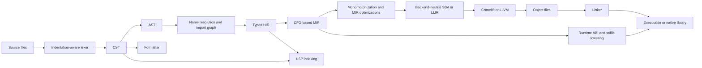
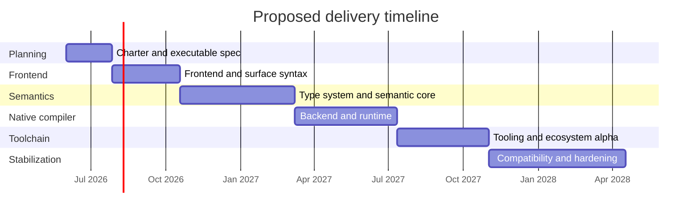

# Building a Rust-Implemented Python-Like Statically Typed AOT Language

## Executive Summary

Creating a new language that looks very much like Python, is statically typed, compiles ahead of time, and is implemented in Rust is feasible, but it is materially easier if the project is framed as a **Pythonic new language** rather than as a **drop-in Python replacement**. Python’s grammar is explicit and machine-readable, but the language reference itself warns that many semantic areas are described in English rather than fully formalized terms, so a faithful reimplementation must still make many judgment calls. Exact compatibility is especially hard around Python’s object model, dynamic namespace behavior, descriptors, metaclasses, `getattr`/`locals`-driven indirection, and `eval`/`exec`. citeturn36view0turn5search7turn36view1turn36view2turn36view3turn36view4

The best precedent set is not “build CPython again in Rust,” but rather “build a typed, compiled language with Python surface ergonomics and carefully bounded semantics.” Codon is the closest formal precedent: it borrows Python 3 syntax and much of its semantics, compiles ahead of time to native code, uses static type checking and inference, remains standalone from CPython, and still explicitly omits some dynamic features; its roadmap also shows that compatibility work remains substantial even after a serious compiler exists. Mypyc demonstrates that a strict, gradually typed Python variant can generate efficient native artifacts, but only by restricting dynamic class behavior. Mojo shows another viable direction: Pythonic syntax plus static typing, ownership, FFI, and Python interop, but at the cost of moving farther away from ordinary Python runtime expectations. citeturn24view0turn27view0turn29view1turn32view0turn32view2turn15search12turn37view0turn35view3

For a greenfield project in Rust, the most defensible architecture is: **Python-faithful surface syntax where possible; a typed core with local bidirectional inference and an explicit dynamic escape hatch; a source-preserving frontend plus typed HIR and CFG-based MIR; a small custom runtime; C ABI interop first; and a backend-neutral lowering path that can target Cranelift first and LLVM later if needed**. Rust’s own compiler architecture shows why a layered HIR/MIR design is valuable, LLVM documents why frontends should preserve source-language semantic facts for optimization, and Cranelift is explicitly positioned as a fast, relatively simple Rust-native backend usable for both AOT and JIT compilation. citeturn28view2turn28view3turn28view1turn28view0turn39view0turn39view1

Under the scoped assumptions in this report, a serious MVP built with mid-range LLM agents is plausibly a **45 million to 115 million token** effort plus roughly **700 to 1,400 human hours**. A more convincing beta with tooling, package workflow, hardening, and broader compatibility is more realistically **77 million to 210 million tokens** and **1,300 to 2,600 human hours**. Those estimates assume disciplined spec anchoring, strong local automation, and that the project does **not** attempt full CPython compatibility in its first major cycle.

## Project Proposal and Assumptions

The project should be proposed as a **new compiled language in the Python family**: one that keeps Python’s indentation, expression forms, module model, and annotation syntax where practical, but replaces Python’s dynamic runtime contract with a statically checkable compiled contract. That positioning aligns with the strongest current precedents. Codon explicitly targets being close to CPython while remaining fully statically compilable, and Mojo explicitly treats Pythonic syntax as the entry point while embracing compiled-language constraints such as ownership, layout, and explicit interop boundaries. citeturn29view1turn15search12turn35view3

The following items are not fully specified by the prompt, so this report makes them explicit assumptions:

- The language is **not** expected to be a drop-in CPython replacement.
- “Python-like” means **high surface fidelity to Python 3 syntax**, especially indentation, control flow, expressions, imports, and type annotation syntax.
- The implementation is **AOT-first** and does not ship an interpreter or bytecode VM as a primary execution model.
- The MVP uses **one primary native backend**, not multiple production backends from day one.
- The MVP targets **Linux and macOS first**, with Windows support following once toolchain, linker, and debugger integration stabilize.
- The MVP provides **C ABI interop first**; Python ecosystem interop is secondary.
- The MVP ships with a **small standard library**, not Python’s full batteries-included surface.
- The compiled language enforces **compile-time type validity** for code that is not explicitly marked as dynamic.

### Recommended minimal MVP

The minimal viable product should support: modules and imports; scalar types (`int`, `bool`, `float`, `str`); homogeneous containers; typed functions with Python-style annotations; local type inference inside function bodies; fixed-layout classes with declared attributes; `if`, `while`, `for`, `range`, and list comprehensions; basic exceptions; native executable and library output; and C ABI FFI. It should intentionally **exclude** `exec`, `eval`, monkey-patching, runtime descriptor magic, custom metaclasses, deep reflection, CPython extension ABI compatibility, and full `asyncio` semantics. That choice is consistent with Python’s typing PEPs, which treat type hints primarily as static-analysis structure rather than as a fully specified runtime model; with Codon’s explicit omission of some dynamic features; and with mypyc’s need to narrow dynamic class behavior for performance. citeturn36view5turn36view6turn24view0turn32view0turn32view2turn29view3

The MVP should also reuse Python’s familiar annotation forms rather than invent new ones. PEP 484 established annotations as the standard static surface, and PEP 526 extended that surface to variables. That is the lowest-risk way to preserve Python feel while making the language significantly more analyzable. citeturn36view5turn5search13

### Recommended long-term target

The long-term target should be a **Pythonic systems-and-data language** rather than a “faster Python.” In practical terms, that means: better generic support; selective gradual typing through a boxed `Dynamic` or `Any` type; data-parallel loops and structured concurrency; stronger interop with Python and C; an opinionated package/build workflow; a capable LSP and formatter; and a backend-neutral IR that allows either one high-speed backend or two tiers later, such as Cranelift for fast development builds and LLVM for more aggressive release optimization. Codon’s bidirectional typed IR and plugin architecture, Mojo’s ownership and Python interop story, and Nim’s packaging/runtime history all point in this direction: the sustainable win is a coherent compiled language ecosystem, not a forever chase after every dynamic edge of CPython. citeturn27view1turn27view2turn35view3turn35view1turn31view2turn31view3

## Language and Runtime Design

### Syntax fidelity to Python

The surface syntax should aim for **very high fidelity**. Python’s official full grammar already gives you an authoritative syntactic base, and Python’s operator and expression conventions are familiar enough that preserving them minimizes adoption cost. This strongly argues for keeping: indentation sensitivity, `def`/`class`, `if`/`elif`/`else`, `for ... in`, comprehensions, imports, decorators where semantically supportable, Python precedence, and Python annotation syntax. Mojo explicitly documents that its operator syntax mirrors Python, and Codon’s central value proposition is that Pythonic syntax materially lowers adoption friction. citeturn36view0turn37view3turn24view0

The place to narrow compatibility is **semantics, not superficial syntax**. Python’s data model treats everything as objects with identity, type, and value; class creation can trigger metaclass logic; descriptors participate in attribute access and class initialization; and everyday code can route behavior through `getattr`, `locals`, and `eval`. Those mechanisms are exactly the spots that undermine fixed layouts, ahead-of-time method resolution, whole-program analysis, and predictable optimization. In other words: aim for “Python code should *look* natural,” but define a smaller, more explicit semantic contract. citeturn36view1turn23search2turn36view2turn36view3turn36view4

### Typing model

A purely explicit type system would simplify implementation, but it would make the language feel much less Pythonic. A purely inferred global type system would preserve aesthetics, but it would increase compile-time complexity, worsen diagnostics, and make incremental tooling harder. The strongest compromise is a **bidirectional static type system**: require type annotations at module and function boundaries where clarity matters, infer aggressively inside bodies, monomorphize generics, and permit an explicit boxed dynamic escape hatch for code that truly needs late binding. That direction has explicit precedent in Codon’s Hindley–Milner-style inference plus monomorphization and delayed instantiation, and in mypyc’s “strict, gradually typed Python variant.” citeturn27view0turn32view0turn36view5turn36view6

The report’s recommendation is therefore:

- **Default mode:** statically typed and fully compiled.
- **Inference:** local and bidirectional, not “guess everything everywhere.”
- **Generics:** nominal and monomorphized.
- **Dynamic escape:** an explicit `Dynamic`/`Any`-style box, with runtime dispatch only when that box is present.
- **Class model:** fixed declared fields; no undeclared attribute injection in compiled classes by default.

This is also where mypyc is instructive: once a compiler wants efficient native classes, it starts forbidding or degrading support for open-ended attribute mutation, many metaclasses, and wide multiple inheritance. That is a warning you should embrace early rather than discover late. citeturn32view2

### Memory model

Memory management is the design dimension most likely to decide whether the result still “feels like Python.” CPython combines reference counting with cyclic garbage collection; Nim documents an ARC/ORC model based on destructors and move semantics rather than classical tracing GC; Mojo adopts ownership with prompt destruction and explicit lifetime tracking. These all work, but they imply very different user models and compiler obligations. citeturn40search0turn31view2turn37view0turn37view1turn37view2

For this project, the recommended path is a **hybrid user-invisible memory model**:

- **Value types** for scalars, tuples, and certain immutable compiled aggregates.
- **Managed reference types** for mutable containers, strings, user objects, and dynamic escape values.
- **No Rust-style ownership syntax in the MVP user model.**

That advice follows from the product goal. If the language is supposed to feel close to Python, then default aliasing and container semantics should not suddenly become borrow-checker problems. Mojo proves that ownership can coexist with Pythonic syntax, but it also proves that this is a different language experience. For an MVP, the better fit is to keep Python-like reference behavior at the surface and reserve ownership-style optimizations for internal lowering or later opt-in features. citeturn37view0turn37view1turn36view1

Long term, a **hybrid optimization story** is desirable: user code writes ordinary Pythonic programs; the compiler internally chooses stack allocation, move elision, borrowed views, or reference management based on types and escape analysis. Nim’s ARC/ORC and Mojo’s ASAP destruction are both useful design references, but neither should be copied directly as the first visible user model. citeturn31view2turn37view1

### Runtime surface, FFI, and concurrency

The runtime should be deliberately small in the first cycle. Python’s standard library is vast, which is one reason “full Python compatibility” explodes scope. Ship only the parts needed to make compiled applications ergonomic: core builtins, strings, containers, iterators/ranges, exceptions, files, paths, environment/process access, and a little serialization. Everything else should initially come through FFI and packages. citeturn5search11turn40search9turn33view0turn31view3

FFI should start with the **C ABI**. Rust’s official FFI guidance assumes C as the common denominator, not direct C++ linkage. Mojo’s standard library exposes a C-oriented FFI with compile-time symbol binding and dynamic loading, and both Mojo and Codon document staged Python interoperability as a separate layer. That suggests the right order of operations: C first, then Python extension/import bridges, then more ambitious ecosystem compatibility. citeturn35view0turn35view1turn35view2turn35view3turn15search0

Concurrency should also be staged. Python’s `async`/`await` surface is only part of the story; the real implementation burden is the event loop, task scheduling, networking APIs, synchronization primitives, subprocess semantics, and cancellation behavior. Codon is a strong calibration point here: it already supports OpenMP-backed parallel loops, but still lists `async`/`await` as roadmap work. Mojo similarly exposes lower-level task runtime machinery rather than pretending concurrency is “just syntax.” The safest recommendation is therefore: **MVP = single-threaded core plus optional thread/data-parallel library features; long-term = structured concurrency and `async`/`await` once MIR and runtime are stable.** citeturn29view3turn29view0turn29view1turn29view2

## Compiler Architecture and Backend Evaluation

The recommended compiler pipeline is a layered one: **tokenizer → CST → AST → name resolution/import graph → typed HIR → CFG-based MIR → backend-neutral SSA/LLIR → codegen backend**. That design is strongly supported by the Rust compiler’s split between HIR and MIR, where HIR still resembles source closely enough for semantic work while MIR is simplified, fully typed, CFG-based, and suitable for dataflow analysis, optimization, and final lowering. Codon’s paper adds one especially relevant lesson: preserve enough high-level structure in the typed IR that optimization passes can still see Pythonic constructs like explicit loops and then, when needed, re-enter type-directed realization. LLVM’s own frontend guidance reinforces the same underlying principle: the more semantic facts the frontend preserves and communicates, the better downstream optimization becomes. citeturn28view2turn28view3turn28view1turn27view1turn27view2turn28view0



A source-preserving CST is worth the extra effort because it lets the formatter, IDE, diagnostics, and refactoring tools share one syntactic truth. A typed HIR is where operator resolution, overload selection, import binding, and generic intent should live. MIR is the right place for explicit temporaries, control-flow simplification, borrow/escape analysis if you later add it, exception edges, and generator/async lowering if those features arrive. Cranelift’s frontend APIs and ISLE internals also illustrate the value of moving into explicit SSA and rewrite-based lowering only after source-language constructs have already been normalized. citeturn39view1turn39view2

### Backend comparison

| Backend option | What it gives you | Main advantages | Main liabilities | Best role |
|---|---|---|---|---|
| Transpile to Rust | Lower typed HIR into generated Rust and delegate native codegen to `rustc` | Fastest bootstrap; immediate access to Cargo, native debuggers, packaging, and mature diagnostics infrastructure | Semantics leak into Rust; poor source mapping unless heavily engineered; Pythonic dynamic/reference semantics become awkward; compile pipeline identity becomes blurred | Short exploratory spike or bootstrap-only path |
| Cranelift | Direct native codegen from your own MIR/LLIR into machine code/object files | Rust-native; fast compile times; relatively simple backend; AOT and JIT capable; approachable implementation size | Smaller optimization envelope than LLVM; fewer decades of language-frontend examples | Best first “real compiler” backend |
| LLVM | Direct lowering to LLVM IR and native machine code | Mature optimization ecosystem; broad targets; strong debug/codegen infrastructure; good long-term performance ceiling | Heavier integration burden; slower compile cycles; more backend complexity | Best long-term optimizing backend |
| C | Generate portable C and rely on the system C compiler | Easy to inspect; broad compiler availability; can simplify some bootstrap/cross-target stories | Adds a second language/toolchain boundary; can distort semantics; historically fragile as a general IR target | Emergency bootstrap or constrained-portability fallback |

The evidence behind those tradeoffs is reasonably clear. Cargo already handles dependency fetching, builds, packaging, and publishing for Rust projects; Cranelift explicitly positions itself as a fast, secure, relatively simple Rust-native backend for both AOT and JIT use; LLVM remains the canonical language-independent typed SSA infrastructure and documents how frontend semantic annotations drive performance; Nim shows a C/C++/ObjC backend family is workable in practice; and LLVM’s own historical release notes explain that its old C backend was removed because of serious problems on nontrivial programs. citeturn33view0turn39view0turn24view1turn28view0turn31view1turn20search19

The report’s recommendation is therefore:

- **Recommended MVP backend:** Cranelift.
- **Recommended production architecture:** a backend-neutral MIR/LLIR that can add LLVM later if optimization pressure justifies it.
- **Recommended bootstrap experiment:** a Rust transpiler only if explicitly time-boxed and treated as disposable infrastructure.

That recommendation also aligns with team composition. A Rust-heavy team with agents will usually move faster in a Rust-native backend than in LLVM bindings and pass infrastructure, while still keeping a path open to LLVM later if code quality ceilings matter. Cranelift’s own documentation emphasizes fast compilation and simpler design as first-class characteristics, which is exactly what early language development needs. citeturn39view0

## Tooling and Ecosystem

A compiled language that aims to attract Python users cannot treat tooling as optional. Cargo and Nimble are instructive because they integrate package discovery, dependency management, build orchestration, and publishing into the everyday language workflow. By contrast, the Python Packaging User Guide exists because packaging in Python is an ecosystem in its own right. For this project, the right choice is to ship a **single official package/build tool** early, with a lockfile, reproducible resolution, native build caching, and a Pythonic module/package layout. In other words: **Cargo-like workflow discipline with Python-like import ergonomics**. citeturn33view0turn31view3turn8search1turn8search4turn37view4turn38view0

The standard library should remain intentionally narrow until the compiler, runtime, and package manager are stable. Python’s standard library is large; even RustPython separates Rust-implemented standard-library pieces from copied CPython-side library content and leans on CPython tests for compatibility work. That is a useful reminder that “language done” and “ecosystem done” are very different milestones. citeturn40search9turn30view0

For editor tooling, LSP should be the required baseline. The protocol exists precisely so a language can implement autocomplete, go-to-definition, diagnostics, and related features once and reuse them across editors. Likewise, debugger integration should target DAP rather than a custom editor-specific debugger protocol. This is the same decoupling pattern at the tooling layer that you want in the compiler. citeturn34view1turn33view1turn34view2turn33view2

Formatter, debugger, and CI choices matter earlier than many language teams expect. A canonical formatter reduces style drift and review noise; rustfmt and Black are both strong examples of language communities converging on stable, opinionated formatting. CI should run parser, typechecker, runtime, package, and compatibility tests on every relevant change; GitHub’s CI documentation and Nim’s contribution guidance both frame green CI as a merge gate, which is exactly what a language implementation needs. RustPython’s use of CPython’s tests is also a model worth copying: define a supported subset, import the relevant conformance cases, and maintain your own skip/expectation harness instead of inventing all tests from scratch. citeturn34view0turn33view5turn33view3turn11search3turn30view0

## Agent-Driven Development Strategy

Agent-assisted development is viable here, but only if the agents are constrained by **living specification artifacts** rather than by broad, free-form “build a language” prompts. Mojo’s official documentation now even ships language-specific AI skills precisely because general model memory is not enough for an evolving language. Your project should do the same with a repository-local spec bundle: `LANGUAGE_SPEC.md`, `GRAMMAR.md`, `TYPE_SYSTEM.md`, `IR_INVARIANTS.md`, `RUNTIME_ABI.md`, and `AGENTS.md`. Then every agent task references those files and a failing test or benchmark before it writes code. citeturn38view1

The most effective agent roles are usually a small, disciplined set rather than a free swarm: one spec-and-acceptance agent; one frontend agent for lexer/parser/CST; one semantic agent for name resolution, typing, HIR, and MIR; one backend/runtime agent; one tooling agent for LSP/formatter/package manager; and one verification agent responsible for compatibility tests, perf regressions, fuzz inputs, and CI triage. RustPython’s architecture document is a good reminder that languages are easiest to understand and test when parser, compiler, and runtime boundaries stay explicit. citeturn30view0

Token efficiency depends much more on workflow shape than on model cleverness. The practical tactics that save the most tokens are these:

- Give agents **small diffs**, not entire subsystems.
- Attach the **exact spec excerpt** and **exact failing tests** to every task.
- Require a **machine-checkable output format**: changed files, invariants respected, tests added, commands run.
- Separate **implementation** and **review** agents; do not ask one agent to generate and validate its own patch in one step.
- Cache a **retrieval pack** containing grammar rules, MIR invariants, ABI notes, and standard diagnostics wording.
- Use agents for **code, tests, and docs in one patch**, but keep each patch single-purpose.
- Prefer **local tools first**: compile, run tests, minimize, then ask the model only about the remaining defect.
- Batch flaky or repetitive failures into a **triage prompt** instead of one prompt per test case.

In practice, those habits usually reduce total token burn more than switching among nearby model tiers.

### Sample prompt templates

```text
Parser task template

You are working on the indentation-aware parser for <language>.
Source of truth:
- GRAMMAR.md sections: <paste relevant rules>
- LANGUAGE_SPEC.md sections: <paste syntax notes>
- Existing files: <file list>
Goal:
- Add support for <feature>, matching the supplied grammar and preserving CST trivia.
Constraints:
- Do not change unrelated parse trees.
- Preserve token spans and comments.
- Keep formatter round-trip stable.
Acceptance tests:
- <paste 3-10 examples with expected parse shape>
Return:
- A patch plan
- The minimal file list to edit
- New tests to add
- Any ambiguities in the grammar
```

```text
Typechecker task template

You are modifying name resolution and the bidirectional type checker.
Source of truth:
- TYPE_SYSTEM.md sections: <paste>
- IR_INVARIANTS.md sections on HIR/MIR: <paste>
- Existing diagnostics style guide: <paste>
Goal:
- Implement typing for <feature>.
Requirements:
- Local inference only unless explicitly specified.
- No implicit fallback to Dynamic.
- Emit a structured diagnostic when inference fails.
Acceptance cases:
- <typed positive cases>
- <negative cases with expected error>
Return:
- Typing rules in plain English
- Required HIR/MIR changes
- The patch
- New golden diagnostics tests
```

```text
Codegen task template

You are lowering MIR to the <Cranelift or LLVM> backend.
Source of truth:
- MIR semantics: <paste>
- Backend ABI notes: <paste>
- Runtime ABI: <paste>
Goal:
- Lower MIR node <node_name>.
Constraints:
- Preserve exception edges and source spans.
- Do not introduce backend-specific assumptions into MIR.
- If a runtime helper is needed, specify its signature exactly.
Acceptance:
- <input MIR snippet>
- <expected observable behavior>
Return:
- Lowering algorithm
- Runtime helper additions if needed
- Tests at MIR and executable level
```

```text
Compatibility and test task template

You are the conformance engineer.
Supported profile:
- <paste supported language subset>
Reference behavior:
- Python reference examples or curated compatibility files: <paste>
Goal:
- Produce a compatibility test file for <feature area>.
Include:
- Straight-line cases
- Edge cases
- Unsupported cases that should fail cleanly
- A minimal benchmark if performance-sensitive
Return:
- Test file
- Expected outputs/errors
- Tags: syntax / typing / runtime / unsupported / perf
```

## Roadmap, Estimates, and Risks

The estimates below assume mid-range coding models, retrieval-anchored prompts, local compile-and-test automation, and a disciplined two-agent loop for implementation and review. Under those assumptions, a real MVP is best budgeted at **45 million to 115 million tokens** and **700 to 1,400 human hours**. A stronger beta-quality toolchain with editor support, packaging, hardening, and broader compatibility is better budgeted at **77 million to 210 million tokens** and **1,300 to 2,600 human hours**.

| Phase | Token estimate | Human-hour estimate | Key deliverables | Success criteria | Key dependencies and risks |
|---|---:|---:|---|---|---|
| Charter and executable spec | 4M–10M | 80–160 | Language charter, supported-profile document, grammar subset, typing charter, runtime exclusions, benchmark corpus, repo conventions | Team stops debating fundamentals in PRs; all future work can point to written source-of-truth docs | Risk: scope sprawl if dynamic compatibility is left vague |
| Frontend and surface syntax | 8M–20M | 140–260 | Indentation-aware lexer, CST, AST, parser errors, formatter skeleton, syntax tests | Parser accepts curated syntax corpus; formatter round-trips supported syntax; spans remain stable | Depends on frozen grammar subset; risk is syntax drift during typing work |
| Type system and semantic core | 18M–45M | 260–520 | Import graph, name resolution, typed HIR, bidirectional inference, generic instantiation, MIR, diagnostics | Core programs type-check; negative-test diagnostics are stable; no silent `Dynamic` fallback | Depends on stable AST/HIR; risk is unsoundness or inference complexity blow-up |
| Backend and runtime | 15M–40M | 240–480 | Primary backend, object model, strings and containers, module init, exceptions, C ABI FFI, linker pipeline | Native binaries run benchmark and sample corpus; FFI smoke tests pass; stack traces are usable | Depends on MIR stability; risk is runtime object model churn |
| Tooling and ecosystem alpha | 12M–35M | 220–440 | Package/build tool, stdlib seed, LSP alpha, formatter completion, docs site, CI matrix | Users can create, build, publish, install, and edit small projects end to end | Depends on source mapping and diagnostics; risk is treating tooling as “later” |
| Compatibility and hardening | 20M–60M | 360–800 | Conformance harness, fuzzing inputs, perf CI, debugger integration, platform matrix, release checklist | Regressions are caught automatically; compatibility boundaries are explicit; beta users can onboard without core-team help | Depends on every earlier phase; risk is late discovery of semantic overreach |



The biggest risks are not parser bugs or codegen defects; they are **product-definition failures**:

| Risk | Why it matters | Mitigation |
|---|---|---|
| Semantic overreach | “Almost Python” can quietly turn into “reimplement all of Python” | Freeze a supported profile early and tag every unsupported construct explicitly |
| Dynamic escape creep | If `Dynamic`/`Any` spreads everywhere, performance and predictability collapse | Make dynamic escape explicit and measurable in diagnostics and perf reports |
| Runtime-model instability | Containers, strings, and exceptions influence every subsystem | Freeze runtime ABI before serious backend and tooling work |
| Backend lock-in | A backend chosen too early can distort MIR design | Keep MIR backend-neutral and isolate lowering layers |
| Tooling lag | Languages without package/build/editor support feel unfinished regardless of compiler quality | Fund package manager, LSP, formatter, and CI no later than alpha |
| Agent drift | Agents will invent semantics if the repo lacks authoritative docs | Maintain spec files, invariants, golden tests, and review-agent gates |

### Prioritized source set

The following primary sources should stay at the top of the project’s retrieval and citation stack:

- **Python language semantics and syntax:** Python Language Reference, Data Model, Full Grammar, and the typing PEPs, especially PEP 483 and PEP 484. citeturn36view0turn36view1turn36view5turn36view6
- **Closest compiled-Python precedent:** Codon’s CC’23 paper plus official docs on overview, roadmap, multithreading, Python extensions, and compilation flow. citeturn24view0turn27view0turn27view1turn27view2turn29view0turn29view1turn35view2
- **Pythonic compiled-language counterpoint:** Mojo docs on language basics, ownership, lifetimes, FFI, Python interoperability, packaging, and agent skills. citeturn15search12turn37view0turn37view2turn35view1turn35view3turn38view0turn38view1
- **Alternative runtime and ecosystem lessons:** Nim manual, backend integration docs, ARC/ORC destructors, and Nimble package manager docs. citeturn31view0turn31view1turn31view2turn31view3
- **Rust implementation precedent:** RustPython architecture and repository docs, especially for parser/compiler/runtime separation and CPython-test reuse. citeturn30view0turn30view1
- **Compiler architecture guidance:** rustc development guide for HIR/MIR layering and LLVM lowering. citeturn28view2turn28view3turn28view1
- **Backend guidance:** Cranelift project docs and API docs; LLVM core docs, LLVM paper, and frontend performance tips. citeturn39view0turn39view1turn39view2turn24view1turn28view0
- **Tooling standards:** LSP, DAP, Cargo, GitHub Actions CI, rustfmt, and Black. citeturn34view1turn34view2turn33view0turn33view3turn34view0turn33view5

The practical bottom line is straightforward: if you want a language that still feels like Python, compiles like a systems language, and is implemented sanely in Rust, the winning strategy is **high syntax fidelity, bounded semantics, a typed core, a small runtime, early tooling investment, and aggressive scope discipline**. That is hard, but it is tractable. Trying to be “Python, but compiled” without those boundaries is where the project becomes unbounded.